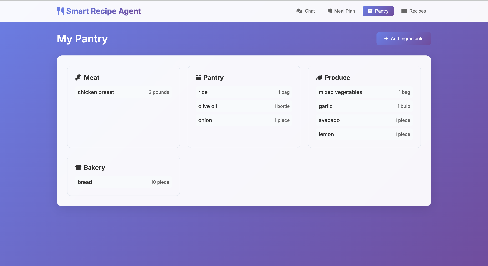
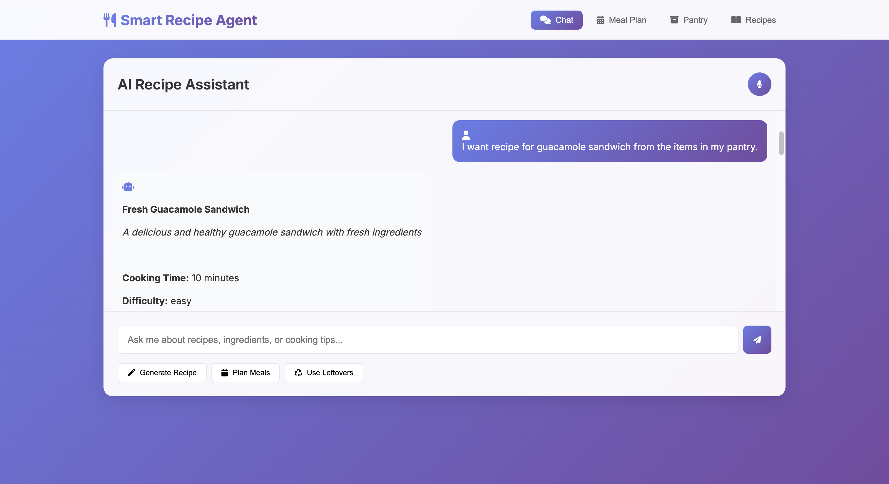
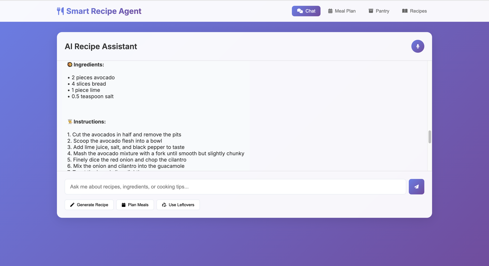
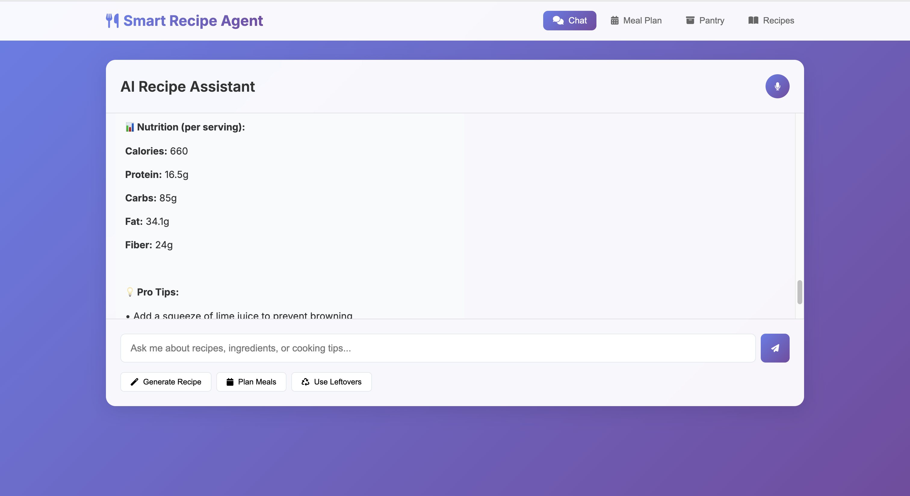

# Smart Recipe & Meal Planning Agent

An AI-powered recipe and meal planning application built on Cloudflare Workers, featuring intelligent recipe generation, pantry management, nutrition tracking, and interactive cooking assistance.

## 🌟 Features


*Modern, responsive interface with AI-powered recipe assistance*

### Core Functionality
- **🤖 AI Recipe Generation**: Generate personalized recipes using Llama 3.3 on Cloudflare Workers AI
- **📦 Smart Pantry Management**: Track ingredients with quantities, categories, and expiration dates
- **🍽️ Interactive Meal Planning**: Create weekly meal plans based on dietary preferences
- **📊 Nutrition Analysis**: Real-time nutrition tracking and dietary restriction compliance
- **🗣️ Voice & Chat Interface**: Natural language input for recipe requests and cooking questions

### Advanced Features
- **♻️ Leftover Optimization**: Creative recipes to use up remaining ingredients
- **🛒 Grocery List Generation**: Automated shopping lists based on meal plans
- **⏰ Cooking Timers**: Built-in timers for multi-step recipes
- **🌱 Seasonal Suggestions**: Recipe recommendations based on seasonal ingredients
- **💾 Persistent Memory**: User preferences, past meals, and cooking history

## 🏗️ Architecture

### Backend (Cloudflare Workers)
- **Main Worker**: API routing and request handling
- **Durable Objects**: State management for users, recipes, and meal plans
- **Workers AI**: Llama 3.3 integration for intelligent recipe generation
- **KV Storage**: Persistent data storage for user preferences and history

### Frontend (Cloudflare Pages)
- **Modern Web UI**: Responsive design with real-time updates
- **Voice Integration**: Speech-to-text for hands-free operation
- **Interactive Components**: Chat interface, modals, and dynamic forms
- **Local Storage**: Offline capability and performance optimization

## 🚀 Quick Start

### Prerequisites
- Node.js 18+ and npm
- Cloudflare account with Workers AI access
- Git

> 📋 **Detailed Requirements**: See [REQUIREMENTS.md](REQUIREMENTS.md) for complete system requirements, dependencies, and setup instructions.

### 1. Clone and Setup
```bash
git clone https://github.com/yourusername/cf_ai_smart_recipe_agent.git
cd cf_ai_smart_recipe_agent
npm install

# Optional: Install Python dependencies for testing utilities
pip install -r requirements.txt
```

### 2. Local Development
```bash
# Start both mock API server and frontend
./start-local.sh

# Or start individually:
npm run start:mock-server  # Mock API on port 3002
npm run start:frontend     # Frontend on port 3000
```

### 3. Access the Application
- **Frontend**: http://localhost:3000
- **API**: http://localhost:3002/api
- **Health Check**: http://localhost:3002/health

## 🧪 Testing the Application

### 1. Basic Functionality Test
1. Open http://localhost:3000
2. Navigate to **Pantry** section
3. Click **"Add Ingredients"** and add:
   - Avocado (2 pieces)
   - Bread (4 slices)
   - Lime (1 piece)
   - Salt (0.5 teaspoon)


*Pantry management interface showing categorized ingredients with quantities*

### 2. Recipe Generation Test
1. Go to **Chat** section
2. Type: `"Generate a recipe for guacamole sandwich from my pantry"`
3. Observe the AI-generated recipe
4. Type `"yes"` to see full recipe details


*Chat interface showing recipe request and AI response*


*Full recipe display with ingredients, instructions, and nutrition information*

### 3. Interactive Features Test
1. **Voice Input**: Click microphone icon and speak recipe requests
2. **Meal Planning**: Go to **Meal Plan** section and create weekly plans
3. **Nutrition**: Request nutrition analysis in chat
4. **Timers**: Use cooking timers for multi-step recipes

### 4. Advanced Features Test
1. **Leftover Optimization**: Ask "What can I make with my leftovers?"
2. **Grocery Lists**: Generate shopping lists from meal plans
3. **Seasonal Recipes**: Request seasonal ingredient suggestions
4. **Dietary Restrictions**: Set preferences and see filtered recipes


*AI Recipe Assistant showing nutrition information and pro tips*

## 📱 User Interface Guide

### Main Navigation
- **🏠 Home**: Dashboard with quick actions and recent recipes
- **💬 Chat**: AI assistant for recipe requests and cooking questions
- **📦 Pantry**: Ingredient inventory management
- **🍽️ Meal Plan**: Weekly meal planning interface
- **📊 Nutrition**: Health tracking and dietary analysis
- **⏰ Timers**: Cooking timer management

### Chat Interface
- **Natural Language**: Ask questions like "What can I make with chicken and rice?"
- **Follow-up Responses**: Interactive conversation flow
- **Voice Input**: Hands-free recipe requests
- **Recipe Display**: Formatted recipes with ingredients and instructions

### Pantry Management
- **Add Ingredients**: Categorized ingredient input with quantities
- **View Inventory**: Organized by categories (Produce, Meat, Pantry, etc.)
- **Update Quantities**: Easy quantity management
- **Expiration Tracking**: Monitor ingredient freshness

## 🔧 Development

### Project Structure
```
├── src/
│   ├── worker.js              # Main Cloudflare Worker
│   ├── durable-objects/       # State management objects
│   └── services/              # Business logic services
├── client/                    # Frontend application
│   ├── index.html            # Main HTML
│   ├── app.js                # Frontend JavaScript
│   └── styles.css            # Styling
├── mock-server.js            # Local development API
├── wrangler.toml             # Cloudflare configuration
└── package.json              # Dependencies and scripts
```

### Available Scripts
```bash
npm run dev          # Cloudflare Workers development
npm run deploy       # Deploy to Cloudflare
npm run build        # Build for production
npm run test         # Run test suite
npm run demo         # Run feature demonstration
```

### Environment Setup
1. Copy `env.example` to `.env`
2. Configure Cloudflare API tokens
3. Set up Workers AI access
4. Configure KV namespaces

## 🌐 Deployment

### Cloudflare Workers Deployment
```bash
# Login to Cloudflare
wrangler login

# Deploy worker
wrangler deploy

# Deploy frontend to Pages
wrangler pages deploy client
```

### Environment Variables
- `CLOUDFLARE_AI_TOKEN`: Workers AI access token
- `KV_NAMESPACE`: KV storage namespace ID
- `DURABLE_OBJECTS`: Durable Object bindings

## 🎯 Demo Scenarios

### Scenario 1: First-Time User
1. Add basic pantry ingredients
2. Ask for a simple recipe
3. Follow cooking instructions
4. Set up dietary preferences

### Scenario 2: Meal Planning
1. Create weekly meal plan
2. Generate grocery list
3. Track nutrition goals
4. Optimize leftover usage

### Scenario 3: Advanced Cooking
1. Request complex recipes
2. Use cooking timers
3. Get nutrition analysis
4. Save favorite recipes

## 🔍 API Documentation

### Recipe Generation
```http
POST /api/recipes/generate
Content-Type: application/json

{
  "ingredients": ["chicken", "rice", "vegetables"],
  "dietary_restrictions": ["gluten-free"],
  "preferences": {"cuisine": "asian"}
}
```

### Pantry Management
```http
GET /api/user/preferences?user_id=123&type=pantry
POST /api/user/preferences
```

### Meal Planning
```http
POST /api/meal-plan/create
{
  "user_id": "123",
  "week_start": "2024-01-01",
  "preferences": {...}
}
```

## 🤝 Contributing

1. Fork the repository
2. Create a feature branch
3. Make your changes
4. Add tests for new functionality
5. Submit a pull request

## 📄 License

This project is licensed under the MIT License - see the LICENSE file for details.

## 🙏 Acknowledgments

- Cloudflare Workers AI for LLM integration
- Llama 3.3 for intelligent recipe generation
- Modern web technologies for responsive UI
- Open source community for inspiration and tools

---

**Built using Cloudflare Workers, AI, and modern web technologies**